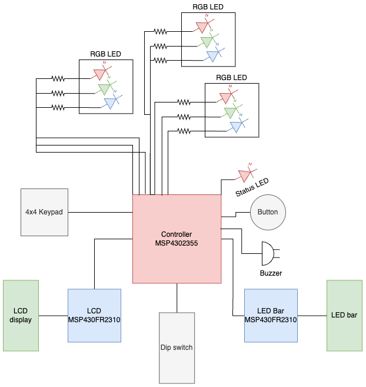
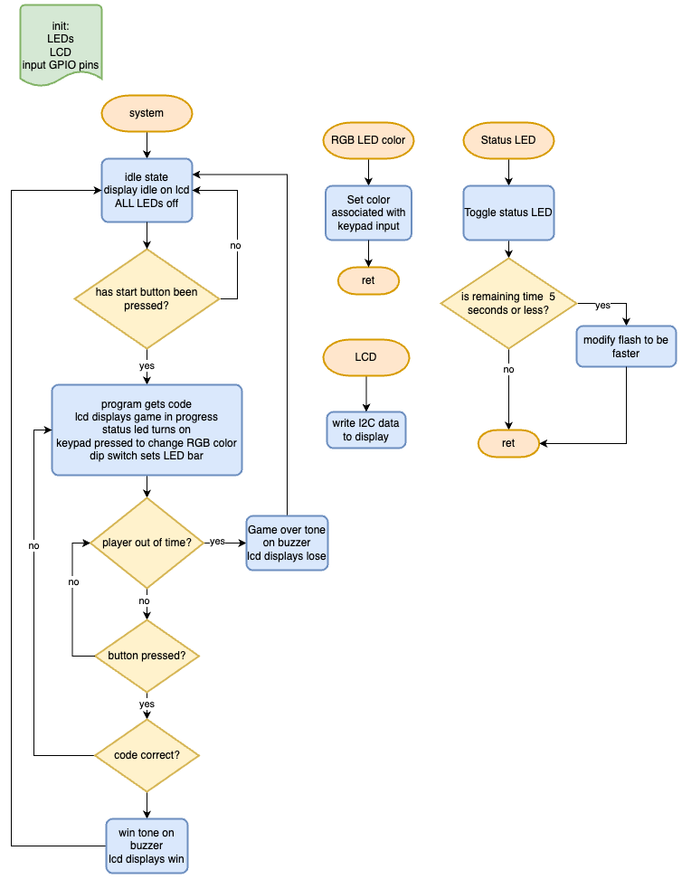

# Final project proposal

- [rm] I have reviewed the project guidelines.
- [rm] I will be working alone on this project.
- [rm] No significant portion of this project will be (or has been) used in other course work.

## Embedded System Description

The final project is a code breaking game inspired by the MasterMind board game. This is a timed game where the player must enter the code within a certain period of time. The code will be two parts, the first is RGB LED and the second will be set using a dip switch. The inputs are a button, a 4x4 membrane keypad, and dipswitch. These control the game start and stop, the RGB LEDs, and an LED lightbar respectively. The project will have a few outputs: an LCD display to indicate the current game state, a buzzer that plays when the game is finished, an LED lightbar to show the dip switch state, and a status LED to indicate time remaining. The player will start the game with one button press, input their guess in the order directed by the LCD and submit the guess with a second button press. This will repeat until the player has either guessed the code or the timer has run out.

## Hardware Setup

The hardware required is as follows
    MSP430FR2355
    MSP430FR2310 x2
    PB-12N32MP-05AQ Buzzer & Audio Indicator
    4x4 Membrane Keypad
    RGB LED x3
    Red LED
    Dip switch
    LED lightbar
    Button

The MSP430FR2355 will be the main controller and will handle the buzzer, LEDs, button, and dip switch. It will interface with the MSP430FR2310s (set as slaves) to control the LCD display and LED bar.

## Software overview

The player will start the game by pressing the button. They will be given a certain period of time to enter the correct code. As the code is entered, the RGB LEDs and LED bar will change accordingly. The status LED will indicate when time is almost up. Guesses will not be reset. The game over buzzer will be different depending on if the player finished the game within the time limit.

## Testing Procedure

Testing will include one failed attempt and one successful attempt. The failing test will both attempt to input the wrong code and run out of time. This will cover the incorrect code message, change in status LED and fail buzzer. The second test will submit the correct code, which will demonstrate the successful code message and win buzzer. Both tests will show similar outputs on the RGB LEDs and LED Bar.

## Prescaler

Desired Prescaler level: 

- [ ] 100%
- [ ] 95% 
- [x] 90% 
- [ ] 85% 
- [ ] 80% 
- [ ] 75% 

### Prescalar requirements 

**Outline how you meet the requirements for your desired prescalar level**

**The inputs to the system will be:**
1.  Keypad
2.  Button
3.  Dipswitch

**The outputs of the system will be:**
1.  Buzzer
2.  RGB LEDs
3.  LCD display messages
4.  LED bar

**The project objective is**

The goal of this project is to create a fun and slightly challenging time-sensitive, code-breaking game requiring players to match a code using RGB LEDs and dip switch input.

**The new hardware or software modules are:**
1. Dip switch
2. Buzzer

The Master will be responsible for:

The master controller will handle user inputs, process the game logic, control the buzzer and status LED, and communicate with the slaves for LCD and LED lightbar updates.

The Slave(s) will be responsible for:

One slave will handle the LCD display output, while the other will control the LED lightbar, both responding to the master’s commands via I2C.

### Argument for Desired Prescaler

This project uses 3 inputs: keypad, button, and dip switch and 3 outputs: buzzer, LED bar, and LCD display. It also utilizes a master/slave topology to control peripheral devices. There is an objective of creating an interactive game, utilizing skills from this class, such as the I2C protocol and timers, to interact with hardware that has not been used in this class. With this in mind, I believe the project thus satisfies the requirements outlined for the 90% prescaler level.
